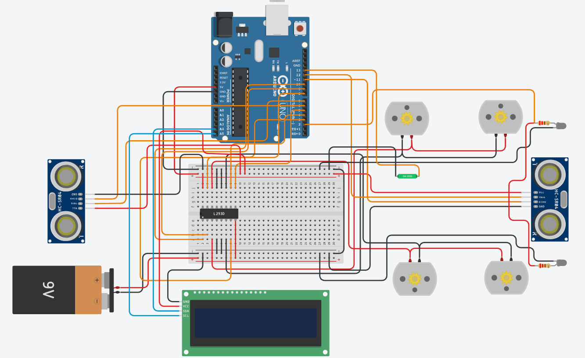

# Tinkercad_Rover_Car
u proje, Arduino Uno kullanılarak geliştirilmiş, 4 çeker (skid-steer) bir otonom/manuel kontrol sistemidir. L293D motor sürücüsü, HC-SR04 mesafe sensörleri ve akıllı aydınlatma sistemi (LED) içerir.

## Özellikler
* Klavyeden Seri Monitör aracılığıyla yön kontrolü (W, A, S, D, Boşluk).
* Ön ve arka sensörler ile çarpışma önleyici acil fren sistemi (20 cm).
* Mesafe 50 cm'nin altına düştüğünde uyarı sistemi.
* Yönlere göre otomatik yanan farlar ve geri viteste çalışan flaşörlü stop lambaları.
* I2C LCD ekran üzerinden anlık durum takibi.

## Kullanılan Donanımlar
* Arduino Uno R3
* L293D Motor Sürücü Entegresi
* 4x DC Motor
* 2x HC-SR04 Ultrasonik Mesafe Sensörü
* 16x2 I2C LCD Ekran
* LED'ler ve Dirençler

## Devre Şeması

